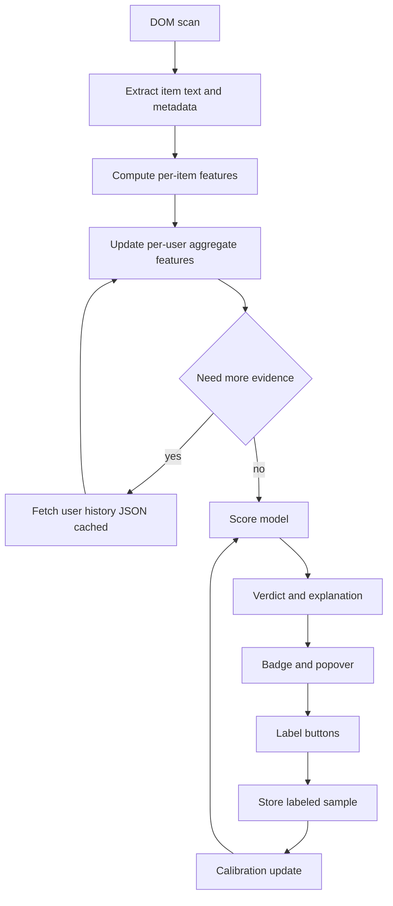

# RedditSlopSleuth v2 plan: data-driven, effective, userscript-friendly

Reference implementation: [`redditslopsleuth.user.js`](../redditslopsleuth.user.js:1)

## Goals

1. **Actually produce reliable 🤖/🧠 hits** in real browsing, not just noisy rule logs.
2. **Language-robust** behavior (not English-only), without throwing away genuinely useful signals.
3. Keep it **userscript-only**: no server, no external ML model, no heavy dependencies.
4. Remain **explainable**: every verdict needs an evidence breakdown (features + weights).
5. Be **data-driven** via local labeling + calibration.

## Constraints and what we can exploit

- We can fetch Reddit JSON endpoints (same-origin) with strict **rate limiting + caching**.
- We can store state in `localStorage` (bounded, versioned).
- We can add lightweight UI: badge popover + drawer.
- We can compute fast features per item and per user.

We should assume:

- **Any single text-only heuristic** is weak (high false positives).
- **Behavioral patterns** and **repetition** are much stronger and more language-agnostic.

## High-level architecture

### Pipeline overview

### Key shift from v1

v1 primarily classifies based on single-item scores and a couple profile fields.

v2 treats each observed item as **evidence** and maintains a **rolling per-user belief** (a lightweight model score) that becomes more confident as we see more content or fetch history.

This addresses the core issue you observed: lots of rule logs, but almost no threshold crossings.

## Data sources (aggressive but safe)

Existing:

- `/user/<u>/about.json` (already implemented)

Add (up to 4 extra requests per user per day, cached):

- `/user/<u>/overview.json?limit=25`
- `/user/<u>/comments.json?limit=25`
- `/user/<u>/submitted.json?limit=25`

Optional (only for link-heavy accounts, still within budget):

- Fetch the next page once for the most informative endpoint (eg, `submitted`) if we need more examples.

### Fetch policy

- **On-demand**: do not fetch for every user.
- Fetch only when the current evidence is in the uncertain band, eg verdict is `unknown` but close.
- Cache per user per endpoint with:
  - TTL 24h
  - daily request counter
  - exponential backoff on 429

Implementation will extend the existing queueing logic in [`getUserProfile()`](../redditslopsleuth.user.js:1295).

## Pretraining datasets (ship a small pretrained weight vector)

We will not ship a large text model. We will ship a **tiny linear model** (logistic regression) over engineered features.

Recommended sources:

- **GRiD (GPT Reddit Dataset)**: Reddit + GPT-3.5-turbo responses, purpose-built for GPT detection.
  - Repo: https://github.com/madlab-ucr/GriD
  - Paper excerpt mentions 6513 samples and Reddit subreddits (AskHistorians, AskScience, ExplainLikeImFive).

- **HC3 (Human ChatGPT Comparison Corpus)** as the generic dataset:
  - Hugging Face dataset: https://huggingface.co/datasets/Hello-SimpleAI/HC3
  - Covers multiple domains; helps generalize beyond Reddit.

Note: before final shipping, we should confirm licenses/attribution requirements for these sources and document them here.

## Feature set

We split features into families. The model can be trained, but we also keep sensible priors.

### 1. Spam and bot promotion features (high-signal, language-agnostic)

Per item:

- link count and ratio
- suspicious domains or TLDs
- repeated affiliate params and tracking params
- repeated call-to-action patterns

Per user from history:

- link-post ratio
- domain diversity vs volume
- high repost rate to same domains
- near-duplicate titles across submissions

Existing starting points:

- [`bot.multiple_links`](../redditslopsleuth.user.js:1140)
- [`bot.suspicious_tld`](../redditslopsleuth.user.js:1132)

### 2. Repetition and templating (strong, mostly language-agnostic)

Per item:

- repeated line templates within the same text
- abnormal redundancy

Per user from session and fetched history:

- repeated near-duplicate comments across different threads
- repeated submission titles with small edits

Existing starting points:

- [`bot.near_duplicate_same_user`](../redditslopsleuth.user.js:1147)
- normalization utilities like [`normalizeForNearDuplicate()`](../redditslopsleuth.user.js:503)
- [`ai.repeated_line_templates`](../redditslopsleuth.user.js:1025)

### 3. Behavioral cadence and distribution (strong, language-agnostic)

From `/comments.json` and `/submitted.json`:

- burstiness: many items within short time windows
- regular periodic posting
- subreddit diversity vs volume
- account age and karma as context, not a verdict

Existing starting point:

- [`scoreProfile()`](../redditslopsleuth.user.js:449)

### 4. Structure regularity (moderate signal, language-agnostic-ish)

Per item:

- section density
- heavy list formatting
- uniform sentence lengths
- high numeric density

Existing starting points:

- [`ai.high_section_density`](../redditslopsleuth.user.js:985)
- [`ai.structured_list_formatting`](../redditslopsleuth.user.js:973)
- [`ai.long_uniform_sentences`](../redditslopsleuth.user.js:960)
- [`ai.high_numeric_density`](../redditslopsleuth.user.js:1067)

### 5. Language-dependent style signals (kept, but gated)

These can help accuracy in English, but should not penalize other languages.

- Contractions and similar style markers should only contribute when we detect the text is likely English.

Plan:

- Add a cheap `englishLikeScore` feature using a small stopword list and ASCII ratio.
- Apply `low_contractions` only when `englishLikeScore` exceeds a threshold.

This preserves the potential usefulness of [`ai.low_contractions`](../redditslopsleuth.user.js:947) without corrupting multilingual feeds.

## Scoring model and calibration

### Model choice

Use a lightweight multi-class linear model:

- softmax logistic regression with L2 regularization
- sparse features
- online or batch training from locally labeled examples

This is implementable in a userscript, explainable, and fast.

### Practical details

- Features are numeric and are either:
  - counts
  - ratios
  - discretized buckets
  - boolean flags
- Maintain per-feature weights per class
- Provide a stable model version number and migrate storage if needed

### Output

For each user and item:

- `p_bot`, `p_ai`, `p_human`
- label = argmax
- confidence derived from max probability and margin

### Why this fixes the current effectiveness issue

Instead of trying to hand-pick thresholds like `ai >= 6`, we:

- start with reasonable priors
- then tune weights automatically based on your own labels

This turns rule hits into a calibrated decision boundary.

## Decision policy: avoid single weak-feature verdicts

Even with a model, implement guardrails:

- require at least 2 independent evidence families for 🧠 unless the evidence is extremely strong
  - example strong evidence: explicit self-disclosure pattern
- cap the influence of weak, common features
- keep spam features high-weight for 🤖

This will be implemented by extending the existing rule evaluation in [`runDeclarativeTextRules()`](../redditslopsleuth.user.js:804) to track families and caps.

## UX: label mode and telemetry

### Label mode

In the popover shown on badge interaction:

- add buttons: Label human, Label ai, Label bot
- store:
  - label
  - timestamp
  - compact feature snapshot
  - stable item id if available

### Export and import

- export labels and the learned model as JSON
- import JSON to restore or share

### Telemetry panel

Add a view in the drawer:

- how many labeled samples per class
- confusion matrix vs current model
- top weighted features for each class
- per-rule firing rates

## Storage schema

All storage should be:

- versioned
- bounded
- garbage collected

Suggested keys:

- `rss:v2:model`
- `rss:v2:labels`
- `rss:v2:userCache:<username>`

## Implementation plan

The execution checklist is tracked in the reminders list. Key code touch points will be:

- feature extraction in [`buildTextFeatures()`](../redditslopsleuth.user.js:570)
- score aggregation and UI in [`createRedditSlopSleuth()`](../redditslopsleuth.user.js:1211)
- rule system extension in [`runDeclarativeTextRules()`](../redditslopsleuth.user.js:804)
- tests in [`redditslopsleuth.test.js`](../redditslopsleuth.test.js:1)
